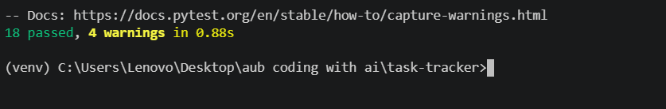
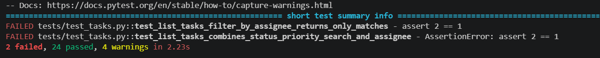

# Verification Report

This documents how the two added features (Search + combined filters, Task comments) were verified: the baseline before any changes, backend test results at each stage, manual checks against the running API, the behavior contract before/after, and two Break Tests proving the test suite actually catches regressions.

## 1. Baseline Check

Before any feature work, the Module 1 skeleton (commit `eaf8a0f`, "Initial commit") was confirmed green:



`18 passed, 4 warnings in 0.88s`. This covered `/health`, basic task CRUD, and status-transition validation only — no search, no filters beyond status/priority, no comments. This is the known-good starting point every later change is measured against.

## 2. Backend Test Results

| Stage | Command | Result |
|---|---|---|
| Baseline (Initial commit) | `pytest -v` | **18 passed**, 4 warnings, 0.88s |
| Mid-work on Feature 1 (Break Test 1, see §5) | `pytest -v` | 2 failed, 24 passed, 2.23s |
| Mid-work on Feature 2 (Break Test 2, see §5) | `pytest -v` | 1 failed, 37 passed, 4.76s |
| Current (`git log` HEAD `58ebe38`, both features complete) | `pytest -v` | **43 passed**, 4 warnings, 2.15s |

Current run (`venv` active, `python -m pytest -v`), tail of output:

```
tests/test_tasks.py::test_get_task_by_id_comment_count_reflects_actual_comment_rows PASSED
tests/test_tasks.py::test_list_tasks_comment_count_is_per_task_not_global PASSED
tests/test_tasks.py::test_delete_comment_decrements_task_comment_count PASSED
tests/test_tasks.py::test_patch_task_preserves_comment_count PASSED
======================= 43 passed, 4 warnings in 2.15s ========================
```

The 4 warnings are pre-existing and unrelated to either feature: an `httpx`/`starlette.testclient` deprecation notice, two `on_event("startup")` deprecation notices (FastAPI recommends lifespan handlers), and one `HTTP_422_UNPROCESSABLE_ENTITY` naming deprecation. None affect behavior.

18 → 43 passing tests reflects: 6 new tests for search/filter/assignee combinations (Feature 1), 10 new tests in `tests/test_comments.py` (Feature 2), and a handful of `comment_count` regression tests added to `test_tasks.py` once that field was introduced.

## 3. Manual Checks Against the Running API

No headless-browser tool was available in this environment to drive `frontend/index.html` directly and capture a rendered screenshot, so this section is an **honest substitute, not a full browser UI check**: the server was started for real (`uvicorn app.main:app --port 8000`) and hit with the exact requests the frontend's `fetch` calls make, exercising the golden path and edge cases end-to-end against the live SQLite-backed API. A real click-through of the kanban board (search box, filter dropdowns, comment modal) in an actual browser is still recommended before calling the UI itself verified — the checks below confirm the API contract the UI depends on, not the rendering/JS wiring on top of it.

**Feature 1 — search + combined filters:**
```
POST /tasks {title: "Fix login bug", status: ToDo, priority: High, assignee: Alex}   → 201
POST /tasks {title: "Write docs",   status: InProgress, priority: Low, assignee: Sam} → 201
GET /tasks?search=login                        → 200, [Fix login bug]      (title/description match)
GET /tasks?status=ToDo&priority=High&search=login → 200, [Fix login bug]   (AND across search+status+priority)
GET /tasks?status=Done&search=login             → 200, []                  (no match → empty list, not an error)
GET /tasks                                      → 200, [both tasks]        (omitting params = unchanged full list)
```

**Feature 2 — task comments:**
```
POST /tasks/1/comments {text: "Reproduced on staging"} → 201, comment id=1
POST /tasks/1/comments {text: "   "}                    → 422, "comment text cannot be blank"
GET /tasks/1/comments                                   → 200, [the comment], oldest-first
GET /tasks/2/comments (no comments yet)                 → 200, []           (empty, not an error)
GET /tasks/1  → comment_count: 1                         (reflects the added comment)
DELETE /comments/1                                       → 204
GET /tasks/1  → comment_count: 0                          (decremented after delete)
DELETE /comments/1 (already deleted)                     → 404, "Comment with id 1 not found"
DELETE /tasks/999 (nonexistent task)                      → 404, "Task with id 999 not found"
```

All requests returned the expected status codes and bodies. Test data (tasks 1 and 2, comment 1) was deleted afterward to leave the local `tasks.db` clean.

## 4. Behavior Contract: Before vs. After Refactor

Comparing the Module 1 baseline (`eaf8a0f`) to the current API (`58ebe38`):

| Aspect | Before (Module 1 baseline) | After (current) | Breaking? |
|---|---|---|---|
| `GET /tasks` params | `status`, `priority` only | adds `search` (substring match on title/description) and `assignee` (exact match), combinable with AND | No — additive, both old params still work identically |
| `GET /tasks` with no params | Returns full list | Returns full list (unchanged) | No |
| `GET /tasks` with no matches | N/A (status/priority always either matched or empty already worked) | Returns `200` with `[]`, never an error | No |
| `TaskResponse` shape | `id, title, description, status, priority, assignee, created_at, updated_at` | adds `comment_count: int` | No — additive field, existing consumers ignoring unknown fields are unaffected |
| Comment endpoints | Did not exist | `POST /tasks/{id}/comments`, `GET /tasks/{id}/comments`, `DELETE /comments/{id}` | No — new routes, nothing removed |
| Comment validation | N/A | Blank or >1000-char comment text → `422` (via a Pydantic `field_validator`, consistent with how `Task.title` is already validated — not the `400` literally specified in the original user story; see [prompt-log.md](prompt-log.md) Feature 2, Prompt 5) | Documented deviation, not a break |
| Status transition rules | `ToDo→InProgress`, `InProgress→Done`, `Done→InProgress`, same-status no-ops; others `422` | Unchanged | No |
| Title validation | Trimmed, non-empty, ≤200 chars, `422` | Unchanged | No |
| `extra="forbid"` on create/update schemas | Yes | Yes (also applied to the new `CommentCreate`/`CommentResponse`) | No |
| CORS allowlist | `http://localhostt:5500` (typo), `127.0.0.1:5500`, `localhost:5173`, `null` | Unchanged | No |

No existing endpoint, field, or status code changed meaning — every change across both features was additive. This was confirmed by the baseline suite (18 tests, all pre-existing behavior) still passing unmodified inside the current 43-test suite.

## 5. Break Test Evidence

Two cases from the actual development process where the test suite caught a real regression before it shipped:

### Break Test 1 — Feature 1 (assignee filtering)



```
FAILED tests/test_tasks.py::test_list_tasks_filter_by_assignee_returns_only_matches - assert 2 == 1
FAILED tests/test_tasks.py::test_list_tasks_combines_status_priority_search_and_assignee - AssertionError: assert 2 == 1
2 failed, 24 passed, 4 warnings in 2.23s
```

**What broke:** the `assignee` filter wasn't being applied as an exact-match `WHERE` predicate in `storage.get_all_tasks` — the query returned every task instead of narrowing to the requested assignee, so tests expecting exactly 1 matching task got 2 back.

**How it was caught:** `test_list_tasks_filter_by_assignee_returns_only_matches` and the combined-filter test both assert an exact result count; both failed immediately with a clear `assert 2 == 1`, pointing straight at "assignee isn't filtering."

**Resolution:** the `assignee` predicate was added to the query in `storage.py`; rerunning the suite afterward returned to green (folded into the 43-passed run in §2).

### Break Test 2 — Feature 2 (deleting an already-deleted comment)


```
FAILED tests/test_comments.py::test_delete_comment_not_found_returns_404 - sqlalchemy.orm.exc.UnmappedInstanceError: Class 'builtins.NoneType' is not mapped
1 failed, 37 passed, 4 warnings in 4.76s
```

**What broke:** `storage.delete_comment` called `session.delete(comment)` without first checking whether `session.get(Comment, id)` had actually returned a row — when the comment didn't exist, it tried to hand SQLAlchemy `None` to delete, which isn't a mapped instance, so it raised instead of surfacing a clean 404.

**How it was caught:** `test_delete_comment_not_found_returns_404` expects a `404` response for a nonexistent comment id; instead the app raised an unhandled `UnmappedInstanceError`, which pytest reported as a failure with the exception type and message rather than a passing/expected-404 result.

**Resolution:** `delete_comment` was changed to check for `None` after the lookup and return `False` (→ route raises `HTTPException(404)`) instead of calling `session.delete(None)`. Confirmed manually in §3 above (`DELETE /comments/1` twice — `204` then `404`), and covered by the passing suite in §2.
